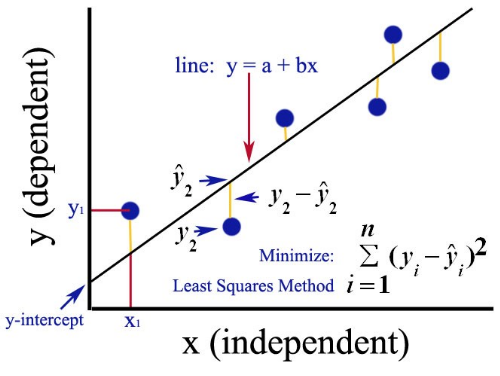

## Ordinary Least Squares

The ordinary least squares (OLS) method is a commonly used statistical technique for regression analysis. It provides a mathematical solution for finding the best-fitting line or curve through a set of data points. The OLS method estimates the parameters of a regression model by minimizing the sum of the squared differences between the observed values and the predicted values.

